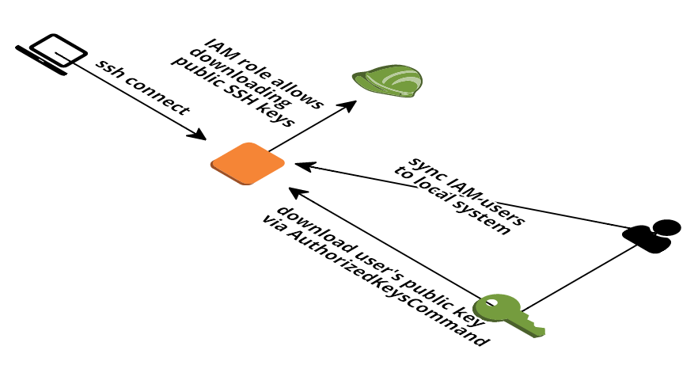

# AWS IAM Bastion

The AWS IAM Bastion is a variant of [cloudposse/terraform-aws-ec2-bastion-server](https://github.com/cloudposse/terraform-aws-ec2-bastion-server) that combines the ideias of [Manage AWS EC2 SSH access with IAM](https://cloudonaut.io/manage-aws-ec2-ssh-access-with-iam/) for use IAM to store and retrieve public SSH keys.

The user needs access to the end hosts private key, belongs to a specific group and upload he's public key to IAM to have access to end-hosts.

The key for this solutions is the sysc_iam_local_users script ([user_data.sh](bastions/user_data.sh)), provisioned with EC2 to provide this functionality.



## Create the bastion

```bash
$ cd bastions/

$ terraform init

$ terraform plan

$ terraform apply

$ terraform show

$ terraform output

Outputs:

instance_id = i-0b61ed36198b6f963
public_ip = [
    XX.XXX.XXX.XXX
]
ssh_user = [
    ubuntu
]
```

## Adding public key to IAM's user

```bash
aws iam upload-ssh-public-key --user-name anderson --ssh-public-key-body "$(<~/.ssh/id_rsa.pub)"
```

Output:

```json
{
    "SSHPublicKey": {
        "UserName": "anderson",
        "SSHPublicKeyId": "XXKAI3ZXXXXXXXFVQQ",
        "Fingerprint": "86:28:bb:aa:XX:a7:af:02:5c:d1:69:XX:70:91:XX:22",
        "SSHPublicKeyBody": "ssh-rsa AAAAB3NzaCasasasasasasasasasah5gIMj0ZFHg6vFDonv35cwFKolD9bac9GcAVCdwihhUgAeSauuiprORE7+cxcxcxcx+QBBU1MUSQfod+r6mi00Q4TjfZBpZ2vthS061JDINhCtoODs8ddIOzwp9812S4V+xcxcxcxc/G0tZB7X9Mp/y6E4wKg+hCCNDvzNDtMjcjuHXPw6y4JQOu3HsuCmwaE1tAd7Ee+xOm5CHJGYVGZR+KadbQwLLV+57SaBz3dlB2VBGS6XUVarqTh4i1Y7Sa7ppkasasasasasasHVDWimAOs9sZ1jBt31qja961JzcjSWOW/K/M/sdsdsdsd+OF+m4LhRfX6h4Vqvef3ZQH8QEqD1Lb8RCnm4SqyuZ8HLZR6j+SEFc1d6+AvOaRuBR8IgFgAKNYjbgUxV+foNAHfuaWcS9k+bPxhvsp8yycPfXXJySPeTnExcxcasasasasaf2Eygd7o7lWUujCAyecBYknkCrx9A+Sj700qFLGwhDELAS3OrOEHJGPyCdO6vHdzz+xcxcxcx
        /mpVJQ== anderson@mac-asantos.local",
        "Status": "Active",
        "UploadDate": "2018-10-22T22:57:11Z"
    }
}
```

### Connecting with IAM user

```bash
ssh anderson@XX.XXX.XXX.XXX
```

## Make it easier with ~/.ssh/config

```
HOST the-bastion
    User anderson
    Hostname ec2-XX-XXX-XXX-XXX.us-west-2.compute.amazonaws.com

HOST 172.40.*
    IdentityFile ~/Keys/bastion-test.pem
    ProxyCommand ssh -W %h:%p the-bastion
```

## Testing

```bash
$ ssh ubuntu@XX.XXX.XXX.XXX -i ~/Keys/bastion-test.pem

$ ssh anderson@XX.XX.XXX.XXX

$ ssh anderson@the-bastion

# Private IPs
$ ssh ec2-user@172.40.9.181

$ ssh ec2-user@172.40.9.248
```

## Logging

```bash
root@bastion:~# tail -f /var/log/syslog | grep sync-iam-user
Oct 23 20:30:01 ip-172-40-9-100 sync-iam-user[8340]: Starting...
Oct 23 20:30:02 ip-172-40-9-100 sync-iam-user[8381]: adding user anderson
Oct 23 20:30:02 ip-172-40-9-100 sync-iam-user[8382]: creating new user anderson
Oct 23 20:30:02 ip-172-40-9-100 sync-iam-user[8390]: adding anderson to st-admin
Oct 23 20:30:02 ip-172-40-9-100 sync-iam-user[8396]: authorizing public key for anderson
Oct 23 20:30:04 ip-172-40-9-100 sync-iam-user[8411]: adding public key for user anderson
Oct 23 20:30:04 ip-172-40-9-100 sync-iam-user[8413]: adding user fabio
Oct 23 20:30:04 ip-172-40-9-100 sync-iam-user[8414]: creating new user fabio
Oct 23 20:30:04 ip-172-40-9-100 sync-iam-user[8422]: adding fabio to st-admin
Oct 23 20:30:04 ip-172-40-9-100 sync-iam-user[8428]: authorizing public key for fabio
Oct 23 20:30:05 ip-172-40-9-100 sync-iam-user[8435]: adding user guilherme
Oct 23 20:30:05 ip-172-40-9-100 sync-iam-user[8436]: creating new user guilherme
Oct 23 20:30:05 ip-172-40-9-100 sync-iam-user[8444]: adding guilherme to st-admin
Oct 23 20:30:05 ip-172-40-9-100 sync-iam-user[8450]: authorizing public key for guilherme
Oct 23 20:30:06 ip-172-40-9-100 sync-iam-user[8465]: adding public key for user guilherme
Oct 23 20:30:06 ip-172-40-9-100 sync-iam-user[8467]: adding user leonardo
Oct 23 20:30:06 ip-172-40-9-100 sync-iam-user[8468]: creating new user leonardo
Oct 23 20:30:06 ip-172-40-9-100 sync-iam-user[8476]: adding leonardo to st-admin
Oct 23 20:30:06 ip-172-40-9-100 sync-iam-user[8482]: authorizing public key for leonardo
Oct 23 20:30:07 ip-172-40-9-100 sync-iam-user[8488]: Finished...
Oct 23 21:00:01 ip-172-40-9-100 sync-iam-user[8678]: Starting...
Oct 23 21:00:02 ip-172-40-9-100 sync-iam-user[8719]: anderson exists
Oct 23 21:00:02 ip-172-40-9-100 sync-iam-user[8720]: updating public key for anderson
Oct 23 21:00:03 ip-172-40-9-100 sync-iam-user[8730]: adding public key for user anderson
Oct 23 21:00:03 ip-172-40-9-100 sync-iam-user[8731]: public key updated
Oct 23 21:00:03 ip-172-40-9-100 sync-iam-user[8733]: fabio exists
Oct 23 21:00:03 ip-172-40-9-100 sync-iam-user[8734]: updating public key for fabio
Oct 23 21:00:04 ip-172-40-9-100 sync-iam-user[8740]: public key updated
Oct 23 21:00:04 ip-172-40-9-100 sync-iam-user[8742]: guilherme exists
Oct 23 21:00:04 ip-172-40-9-100 sync-iam-user[8743]: updating public key for guilherme
Oct 23 21:00:05 ip-172-40-9-100 sync-iam-user[8753]: adding public key for user guilherme
Oct 23 21:00:05 ip-172-40-9-100 sync-iam-user[8754]: public key updated
Oct 23 21:00:05 ip-172-40-9-100 sync-iam-user[8756]: leonardo exists
Oct 23 21:00:05 ip-172-40-9-100 sync-iam-user[8757]: updating public key for leonardo
Oct 23 21:00:06 ip-172-40-9-100 sync-iam-user[8763]: public key updated
Oct 23 21:00:06 ip-172-40-9-100 sync-iam-user[8764]: Finished...
```

🍺 Enjoy!!